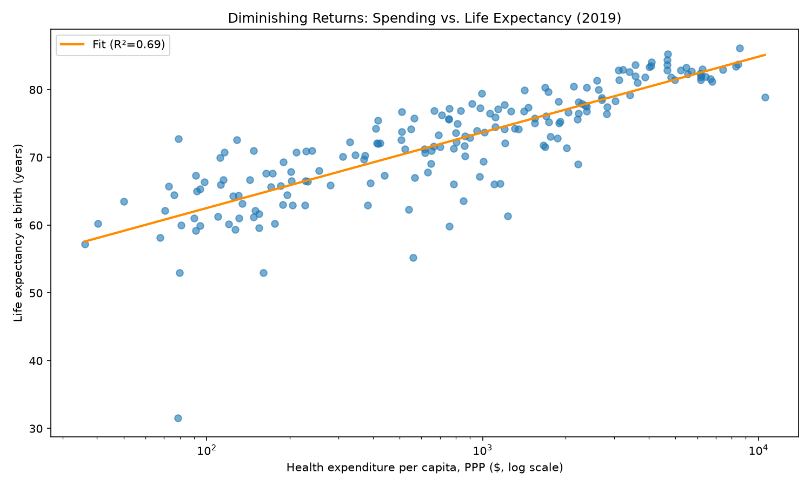

# Does Healthcare Spending Buy Longer Life?

**A data story exploring the relationship between healthcare spending and life expectancy across 193 countries — and the outliers that break the pattern.**



---

## The Question

The United States spends more per person on healthcare than any other country on Earth — and still doesn't have the longest life expectancy. This project digs into why, using two decades of global data to find out whether spending more actually buys a longer life, and where the relationship breaks down.

## Data

| | |
|---|---|
| **Source** | [World Bank](https://data.worldbank.org/), via [Our World in Data](https://ourworldindata.org/grapher/life-expectancy-vs-healthcare-expenditure) |
| **Coverage** | 193 countries |
| **Time range** | 2000–2023 |
| **Key variables** | Healthcare expenditure per capita (PPP-adjusted), life expectancy at birth |
| **Snapshot year** | 2019 (last year with full 193-country coverage, unaffected by COVID-era disruption) |

## Methodology

1. **Clean** — dropped rows missing either variable, removed regional aggregates (e.g. "World", "Europe"), and filtered out implausible data artifacts (`src/clean.py`)
2. **Explore** — checked year-over-year country coverage and summary statistics to choose a reliable snapshot year (`src/explore.py`)
3. **Visualize** — built a cross-country scatter plot (log-scaled spending) and a multi-country time trend (`src/visualize.py`)
4. **Quantify** — fit a linear regression on log-transformed spending to test for a diminishing-returns pattern (`src/analyze.py`)

## Key Findings

**1. Spending and life expectancy are positively correlated, but not linearly.**
Across 193 countries in 2019, the overall correlation is **r = 0.655**.

**2. Diminishing returns are real and measurable.**
A regression on log-transformed spending explains **69% of the variation** in life expectancy (R² = 0.693, p < 0.001). Each 10x increase in healthcare spending is associated with roughly **11 additional years** of life expectancy on average — but the biggest gains happen at the low end of spending, and returns shrink sharply once a country crosses a few thousand dollars per person.

**3. The United States is the clearest outlier.**
Despite spending far more per capita than any other country, the US trails peer nations like Germany, Japan, and the UK in life expectancy — and that gap has widened, not narrowed, over the 2000–2023 period.

## Takeaway

Money matters most where there's little of it. Past a certain point, *how* a country spends seems to matter more than *how much*. The US is proof that high spending alone doesn't guarantee results.

## Visualizations

| Chart | Description |
|---|---|
| `images/spending_vs_life_expectancy_2019.png` | Cross-country scatter, 2019, with the US highlighted |
| `images/life_expectancy_trend.png` | Life expectancy over time — US vs. Germany, Japan, UK |
| `images/diminishing_returns.png` | Scatter with fitted regression line on log-scaled spending |

## Project Structure

```
healthcare-spending-life-expectancy/
├── README.md
├── requirements.txt
├── .gitignore
├── data/
│   └── raw/                # source CSV from Our World in Data
├── src/
│   ├── clean.py            # load, rename, filter, deduplicate
│   ├── explore.py          # coverage checks, summary stats, correlation
│   ├── visualize.py        # scatter plot + time trend
│   └── analyze.py          # regression + diminishing-returns chart
└── images/                 # exported chart PNGs
```

## How to Run

```bash
# clone the repo
git clone https://github.com/SALAHDDINEDKAKI/healthcare-spending-life-expectancy.git
cd healthcare-spending-life-expectancy

# set up the environment
python -m venv .venv
source .venv/bin/activate   # Windows: .venv\Scripts\activate

# install dependencies
pip install -r requirements.txt

# run the pipeline
python src/clean.py
python src/visualize.py
python src/analyze.py
Python src/explore.py
```

## Limitations

- Correlation is not causation — spending is one of many factors (diet, sanitation, healthcare system design, inequality) that shape life expectancy.
- PPP-adjusted spending accounts for cost-of-living differences but not healthcare system efficiency or quality of care.
- The 2019 snapshot avoids COVID-era distortion, but a full pandemic-era comparison is a natural next step.

## Tools

Python · pandas · matplotlib · scipy

## Author

**Salahddine Dkaki** — [https://www.linkedin.com/in/salahddinedkaki/]